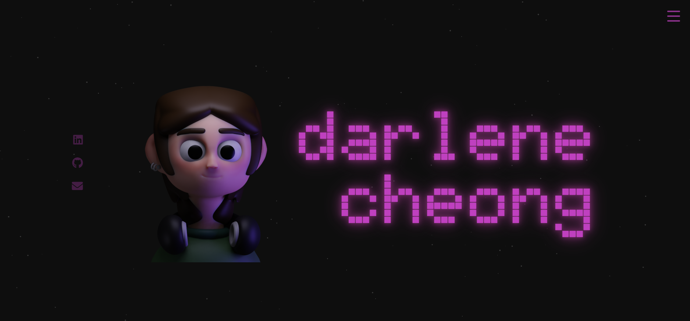

# My Portfolio Website  
This project is my personal portfolio website, created as an introduction to web development and designed to showcase my experiences and work.
  

## Live Demo  
🔗 [View My Portfolio](https://darlenecheong.github.io/Personal-Website/)
  
## Context
This website marks my self-taught initiation into web development, where I built a personal portfolio website using HTML, CSS, and JavaScript. As my first project in web development, it offered invaluable hands-on experience in both front-end design and functionality. Throughout the process, I engaged in planning stages, outlining the structure, layout, and features of the website before moving to development. I explored core design principles, creating a visually engaging user interface and incorporating interactive features. This project served as a practical application of my learning, demonstrating my ability to independently acquire and implement new technical skills, while laying a solid foundation for further web development work.

Word Count: 106 words
  

## Results and Analysis
Through this project, I learned the importance of balancing both form and function in web design. I also developed my problem-solving abilities while encountering challenges like debugging code and optimizing visual space. I learned HTML, CSS, and JavaScript primarily through online tutorials, practice, and experimenting with different layout designs. Beyond the technical aspects, the design follows a simple yet functional layout with smooth navigation between sections. I chose the theme colors based on my personal style, opting for neutral tones and darker shades, which I believe maintains visual consistency and creates an approachable user experience. I also explored digital art by creating my own avatar in Blender, adding another personal touch. 

In the future, I plan to improve accessibility, implementing accessibility features such as better keyboard navigation to ensure the site is usable by a wider audience. Another improvement I am currently working on is refining the mobile experience to ensure navigation remains intuitive and the layout adapts perfectly across devices. Ultimately, this website serves as a continuous project that I can improve upon as I grow my web development skills.

Word Count: 181 words
  

## Preview

  

## Languages Used
- **HTML5** for structure
- **CSS3** for styling
- **JavaScript** for interactive features
